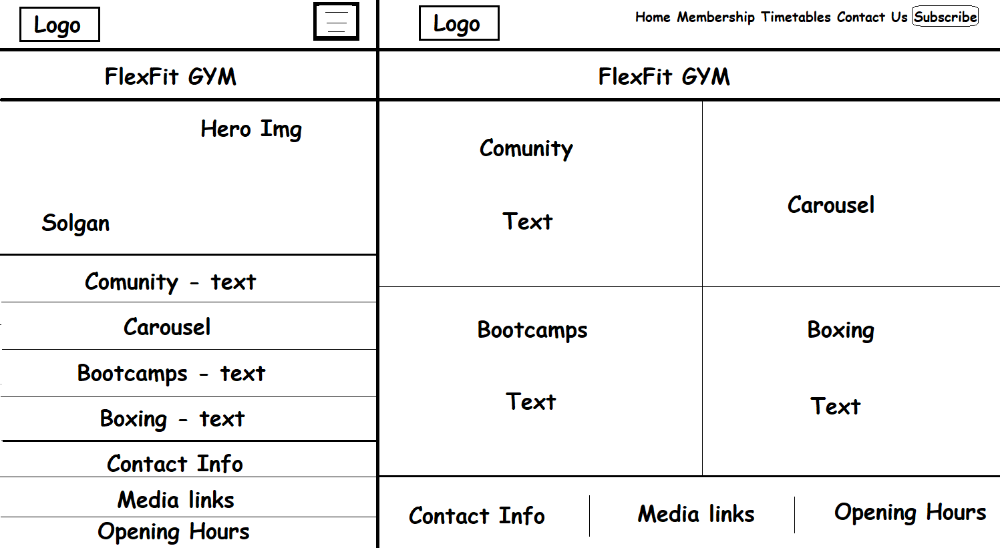
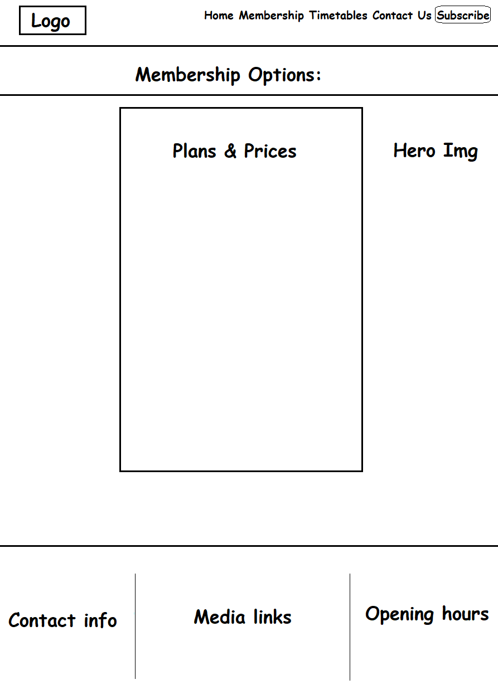
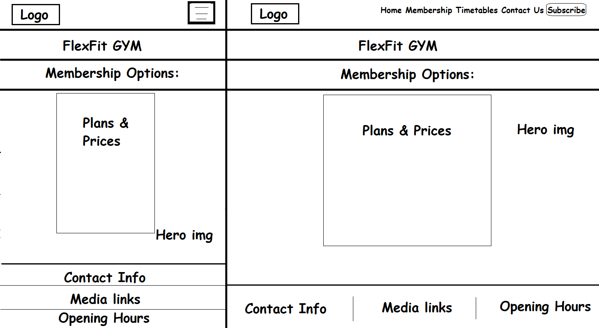
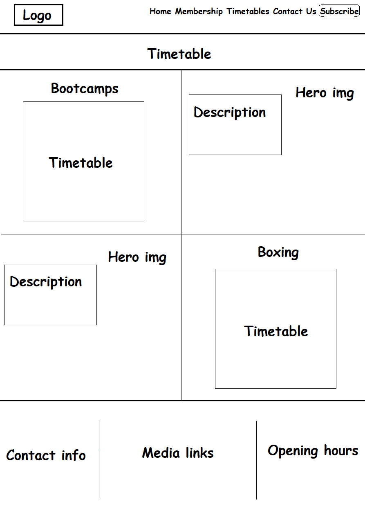
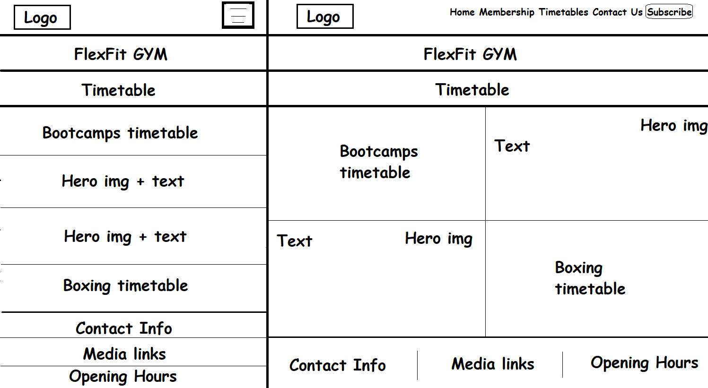
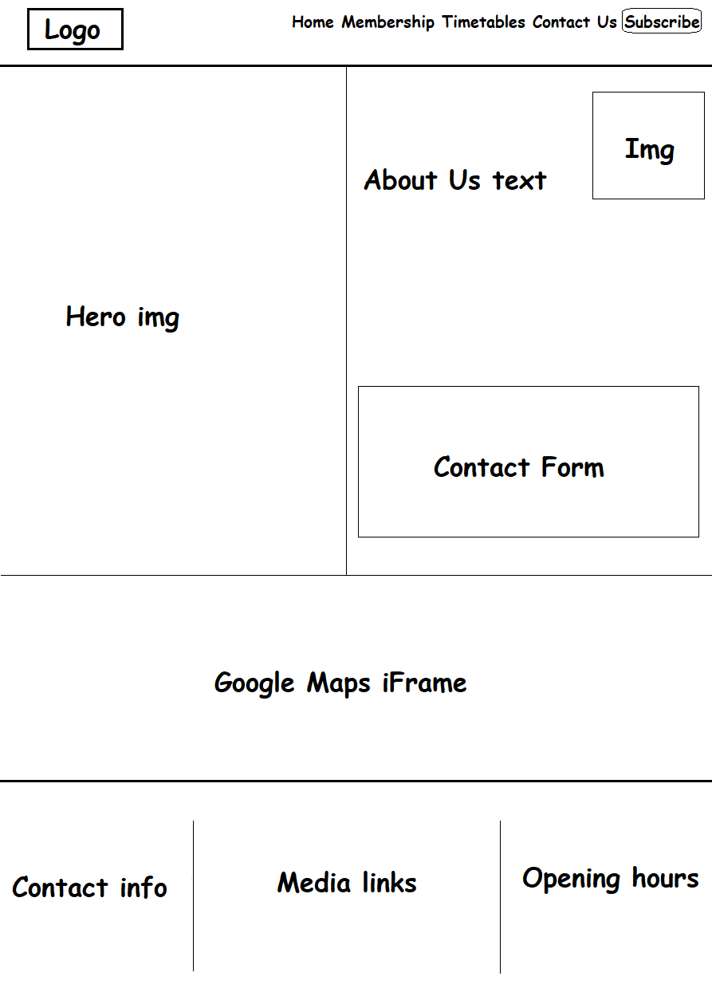
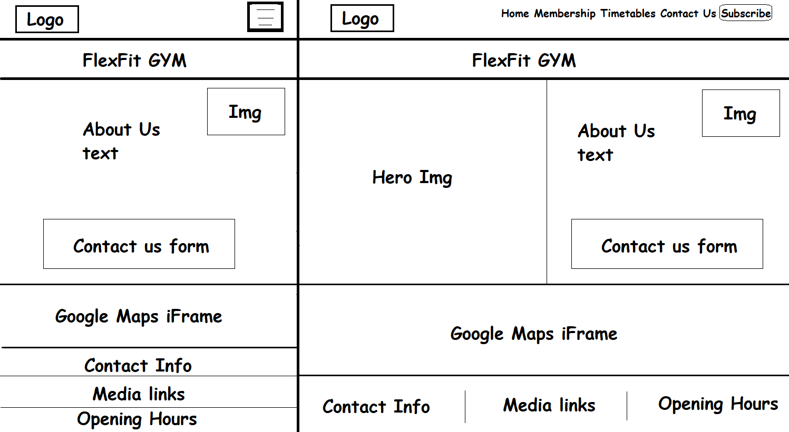

# FlexFit Gym Website Project

## Project Overview
FlexFit Gym's website is designed to provide a comprehensive online presence for our modern gym, catering to fitness enthusiasts of all levels. The site offers detailed information on gym facilities, membership options, fitness programs, and booking capabilities. Built with Bootstrap, the website ensures a responsive and user-friendly experience across all devices, from desktops to mobile phones.

## Technologies Used
- **HTML5**
- **CSS3**
- **JavaScript**
- **Bootstrap 5**: Utilized for responsive design to ensure that the website is accessible and performs well on devices of all sizes.

## User Stories

### User Story 1: Intuitive Interface and Responsive Design (Must-Have)
**As a First-Time Visitor**, I need the website to have intuitive navigation and a user-friendly design that adapts to my device, enabling me to find information efficiently and enhance my user experience.
- **Acceptance Criteria**:
  - The website must be responsive on various devices and screen sizes.
  - Navigation is straightforward, allowing quick access to essential sections.
- **Tasks**:
  - Implement responsive web design principles using Bootstrap.
  - Organize navigation elements to ensure high visibility and accessibility.

### User Story 2: Engaging Visuals and Descriptive Content (Must-Have)
**As a Potential Member**, I want to view high-quality images and read compelling descriptions of the gym's facilities and programs, so I can be motivated to join.
- **Acceptance Criteria**:
  - High-resolution images of the gym's facilities and equipment are featured prominently.
  - Each program has a detailed description highlighting its benefits.
- **Tasks**:
  - Create a gallery or carousel of high-quality images using Bootstrap components.
  - Write and integrate engaging content that accurately describes the gym's offerings.

### User Story 3: Essential Information Accessibility (Must-Have)
**As a Prospective Member**, I need quick access to the gym’s location, contact details, and operating hours, so I can plan my visits easily.
- **Acceptance Criteria**:
  - Information regarding location, contact details, and hours of operation is easily accessible.
- **Tasks**:
  - Design and place a dedicated section for this essential information using Bootstrap's grid system.

### User Story 4: Seamless Booking System (Must-Have)
**As a Gym Enthusiast**, I want to easily book classes or personal training sessions through a simple online form.
- **Acceptance Criteria**:
  - An online booking form is readily accessible and simple to use.
- **Tasks**:
  - Develop an intuitive booking form that integrates seamlessly with the gym’s class schedule.

### User Story 5: Transparent Membership Pricing (Should-Have)
**As a Budget-Conscious User**, I want clear information on membership options and pricing.
- **Acceptance Criteria**:
  - Detailed pricing for various membership tiers is displayed prominently.
- **Tasks**:
  - Display membership pricing clearly on a dedicated page or section using Bootstrap's components.

### User Story 6: Social Proof through Testimonials (Could-Have)
**As a Prospective Gym Member**, I want to read testimonials from current members.
- **Acceptance Criteria**:
  - A testimonials section is included, featuring positive reviews.
- **Tasks**:
  - Design a testimonials page that integrates smoothly into the website’s layout using Bootstrap.

### User Story 7: Newsletter Subscription (Could-Have)
**As a Regular Member**, I want to subscribe to the gym’s newsletter.
- **Acceptance Criteria**:
  - A newsletter subscription form is easily accessible on every page.
- **Tasks**:
  - Integrate a sign-up form into the website's footer using Bootstrap forms.

## Wireframes

### Desktop Version index.html


### Tablet & Mobile Version index.html


### Desktop Version membership.html


### Tablet & Mobile Version membership.html

### Desktop Version timetable.html


### Tablet & Mobile Version timetable.html

### Desktop Version contact.html


### Tablet & Mobile Version contact.html


## Webpage Testing Strategy

### Objective
To ensure that the FlexFit Gym website offers a seamless and efficient user experience across all devices and platforms, I will use a comprehensive testing strategy. This strategy encompasses various tools and methods to test functionality, responsiveness, accessibility, and performance.

### Tools and Methods Used

#### 1. **Chrome DevTools**
- **Purpose:** To initially test the responsiveness and functionality of the website.
- **Process:**
  - Use the responsive design mode to simulate various screen sizes.
  - Test website features and user interactions to ensure functionality across different simulated devices.

#### 2. **Lighthouse**
- **Purpose:** To assess the performance, accessibility, best practices, and SEO of the website.
- **Process:**
  - Run Lighthouse audits from within Chrome DevTools.
  - Analyze the reports to identify areas for improvement in terms of performance, accessibility, SEO, and adherence to web best practices.
  - Implement recommended changes and iterate the audit process to improve scores.

#### 3. **W3C Validation**
- **Purpose:** To ensure the HTML and CSS code meets industry standards and is free from errors.
- **Process:**
  - Use the W3C HTML Validator (https://validator.w3.org/) to validate the HTML of the website.
  - Use the W3C CSS Validator (https://jigsaw.w3.org/css-validator/) to check the CSS.
  - Document any errors or warnings identified and address them to ensure the code adheres to web standards.
  - Re-validate post-fixes to confirm that all issues have been successfully resolved.

#### 4. **Cross-Device Physical Testing**
- **Purpose:** To confirm that the website operates effectively on actual devices, not just in simulated environments.
- **Process:**
  - Test the website on various physical devices including different smartphones, tablets, and desktops.
  - Use a range of browsers (e.g., Chrome, Firefox, Safari, Edge) to ensure compatibility and functionality.
  - Check for visual consistency and interactive elements across devices.

#### 5. **Cross-Browser Testing**
- **Purpose:** To ensure the website displays and functions correctly across various web browsers.
- **Process:**
  - Test on the latest versions of major browsers like Chrome, Firefox, Safari, and Edge.
  - Look for any CSS or JavaScript compatibility issues.
  - Verify that layouts appear as intended and that all functionalities work.

### Reporting and Fixes
- **Bug Reporting:** Any issues found during testing will be documented with screenshots and detailed descriptions.
- **Resolution:** Documented bugs will be prioritized based on their impact and fixed accordingly. Regression testing will be conducted post-fix to ensure no new issues have been introduced.

### Continuous Testing
- **Ongoing Testing:** Webpage testing is an ongoing process throughout the development cycle to catch regressions and bugs as new features are added.

By employing this structured approach to testing, including validation through W3C tools, we aim to deliver a robust, high-performing, and user-friendly website that meets the needs and expectations of all FlexFit Gym patrons.

### Java Scripts by 3rd party
- **Java Script to automatically update the copyright year:**
```javascript
// JavaScript code example
<script>
    document.addEventListener('DOMContentLoaded', function () {
        const year = new Date().getFullYear(); // Get current year
        const copyright = document.querySelector('#contact p'); // Select the copyright paragraph
        copyright.innerHTML = `&copy; ${year} FlexFit GYM. All rights reserved.`; // Set text dynamically
    });
</script>

- **JavaScript code to ensure the Bootstrap mobile navbar collapses when navigating to in-page links:**
```javascript
// JavaScript code example
<script>
    document
        .querySelectorAll(".navbar-collapse .nav-link")
        .forEach((link) => {
            link.addEventListener("click", function (e) {
                let section = document.querySelector(e.target.getAttribute("href"));
                if (section) {
                    e.preventDefault(); // Prevent default anchor click behavior
                    let navbarHeight = document.querySelector(".navbar-toggler").offsetHeight;
                    window.scroll({
                        top: section.offsetTop - navbarHeight, // Adjust for navbar height
                        behavior: "smooth",
                    });
                    document
                        .querySelector(".navbar-collapse")
                        .classList.remove("show"); // Collapse navbar
                }
            });
        });
</script>


## Contact Information
For more information, please contact us at [hk57agob@students.codeinstitute.net](hk57agob@students.codeinstitute.net).
